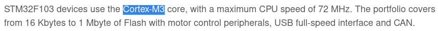
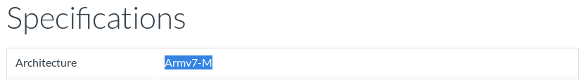

# Alternative STM32 Microcontrollers

## Finding the Correct Target for Your Microcontroller
This is STM32f103 specific. If you are using a different microcontroller check the relevant pages on ARM's website.

For example if I needed to find the target for the STM32f103 microcontroller which is the board this book uses.
I can go to the the STM32f103's page [here](https://www.st.com/en/microcontrollers-microprocessors/stm32f103.html).



In the overview I can see that the microcontroller has a Cortex-M3 core. I then go to the Cortex-M3
[page](https://developer.arm.com/ip-products/processors/cortex-m/cortex-m3). The first thing in the list of
specifications is the architecture which is listed as ARMv7-M.



This means that the target required for the microcontroller is "thumbv7m" and I can use the command
`rustup target add thumbv7m-none-eabi` to add it. Replace "thumbv7m" with your boards instruction set.

## Configuring stm32_starter_rs for your Microcontroller 
Make the changes listed to the following files:

### `./cargo/config`
Using the target name you found in the
[Finding the Correct Target for Your Microcontroller](./alternative.html#finding-the-correct-target-for-your-microcontroller)
section (should be of the form thumbvxx-none-eabi), replace the two instances of "thumbv7m-none-eabi" with your
microcontroller's target.

```
[target.<YOUR TARGET HERE>]

runner = "arm-none-eabi-gdb -q -x openocd.gdb"
rustflags = ["-C", "link-arg=-Tlink.x"]

[build]
target = "<YOUR TARGET HERE>"
```

### `memory.x`

### `openocd.cfg`

### `openocd.gdb`