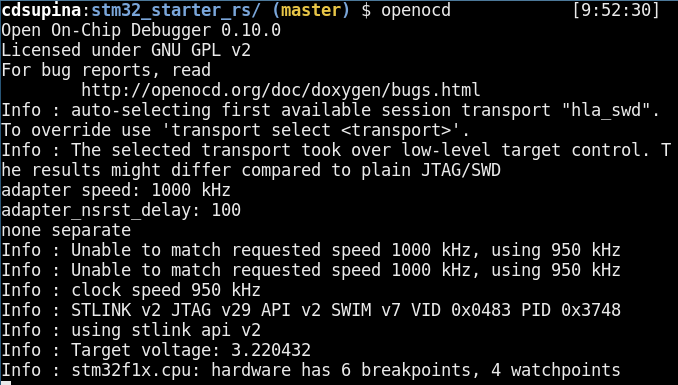

# Getting Started

## Required Hardware

|Name|Image|Price|Link|
|---|---|---|---|
|STM32F103C8T6 Development Board|image|$6.33|[https://amzn.to/32bTqeM](https://amzn.to/32bTqeM)|
|ST-Link V2|image|$8.60|[https://amzn.to/35wE9qM](https://amzn.to/35wE9qM)|

## Install 

- Install rust [https://www.rust-lang.org/tools/install](https://www.rust-lang.org/tools/install)
- Add the the thumbv7m <sup>[1](#myfootnote1)</sup> target `rustup target add thumbv7m-none-eabi`
- Install cargo-generate and cargo-binutils `cargo install cargo-generate cargo-binutils`
- Install llvm-tools-preview component `rustup component add llvm-tools-preview`
- Install openocd and gdb-multiarch using your OS's package manager

## stm32_starter_rs

To ease the process of starting a new embedded project using Rust. We have created a starter repository called
[stm32_starter_rs](https://github.com/Open-Rustbot/stm32_starter_rs). You can clone this repository using the following
command.

```git clone https://github.com/Open-Rustbot/stm32_starter_rs.git```

This repository is setup for the STM32f103 microcontroller, but it can easily be configured for other
STM32 microcontrollers. Now we will proceed to go through each of the files in the directory and their explain purpose.

### `./cargo/config`

### `memory.x`

### `openocd.cfg`

### `openocd.gdb`

## Hello World
After installing the required software we can perform the "Hello World" of the hardware world, a blinking LED.
Take a look at
src/main.rs and make an effort to understand the script.

### Connect the STM32 Microcontroller to Computer

### Launch OpenOCD
After your microcontroller is connected to your computer using the ST-Link, open a terminal, navigate to the root of the
repository, and execute `openocd`. You should see an output similar to the screenshot below.



It is important to be in the same directory of the repository so that openocd can read the openocd.cfg file located in
the directory.

### Run the Program

In another terminal, navigate to the same directory again and this time execute `cargo run`.
This will compile the rust source code, flash it onto the microcontroller, and open a gdb prompt. Enter a `c` in the gdb
prompt to continue the program. You should now see the led on the microcontroller periodically blinking.
This program is now flashed onto the microcontroller, so pressing the reset button will restart the program.

Congratulations! You have successfully run your first embedded rust program!

<br>

<sub><sup><a name="myfootnote1">1. </a>
This is STM32f103 specific. If you are using a different STM32 microcontroller check
[this section](./alternative.html#finding-the-correct-target-for-your-microcontroller) of the appendix for
information on how to find the correct target for your microcontroller.
</sup></sub>

